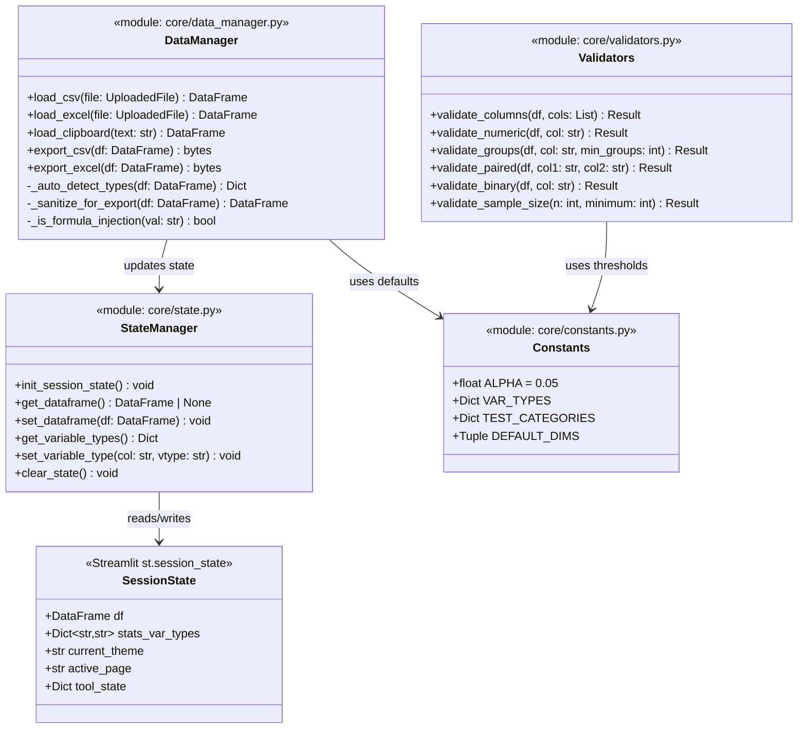
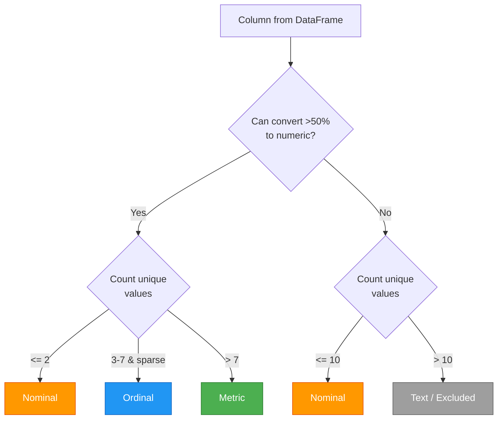
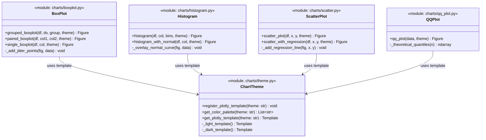
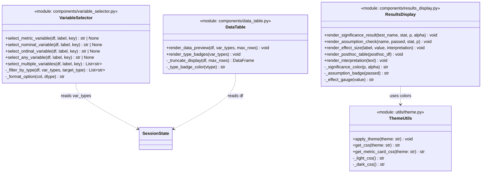
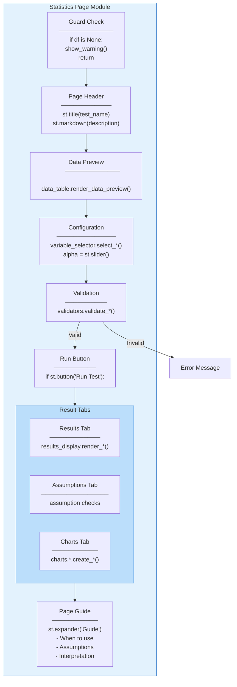
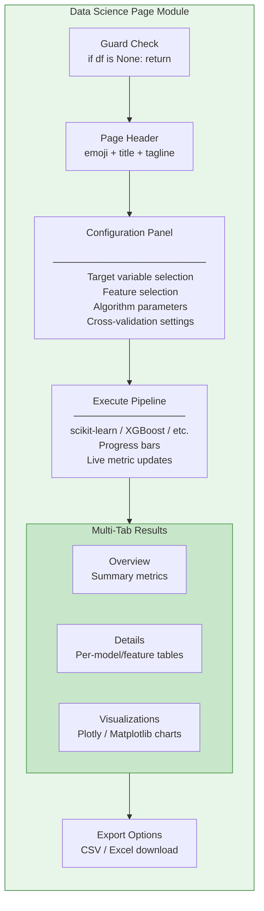

# C4 Model - Level 4: Code Diagram

## Overview

The Code level diagram reveals the internal structure of key modules: function
signatures, data structures, and the fine-grained relationships between code
elements. This level is most useful for onboarding developers and understanding
implementation contracts.

## State Management (core/state.py)

## Statistical Test Contract

All statistical test functions follow a common contract. This diagram shows the
shared interface pattern:

```mermaid
classDiagram
    class TestResult {
        <<TypedDict>>
        +str test_name
        +float statistic
        +float p_value
        +float effect_size
        +str effect_size_label
        +str interpretation
        +Dict assumptions
        +DataFrame | None posthoc
        +Dict confidence_interval
    }

    class TTestModule {
        <<module: stats/ttest.py>>
        +one_sample_ttest(df, col, test_value, alpha) TestResult
        +independent_ttest(df, dv, group, alpha) TestResult
        +paired_ttest(df, col1, col2, alpha) TestResult
        -_welch_correction(group1, group2) float
        -_cohens_d_independent(g1, g2) float
        -_cohens_d_paired(d) float
    }

    class ANOVAModule {
        <<module: stats/anova.py>>
        +oneway_anova(df, dv, group, alpha) TestResult
        +twoway_anova(df, dv, factor1, factor2, alpha) TestResult
        +repeated_anova(df, dv, subject, within, alpha) TestResult
        +mixed_anova(df, dv, subject, within, between, alpha) TestResult
        -_tukey_posthoc(df, dv, group) DataFrame
        -_calculate_eta_squared(ss_effect, ss_total) float
    }

    class MANOVAModule {
        <<module: stats/manova.py>>
        +run_manova(df, dvs, group, alpha) MANOVAResult
        -_multivariate_tests(manova_obj) DataFrame
        -_univariate_followups(df, dvs, group) List~TestResult~
    }

    class NonParametricModule {
        <<module: stats/nonparametric.py>>
        +mann_whitney(df, dv, group, alpha) TestResult
        +wilcoxon(df, col1, col2, alpha) TestResult
        +kruskal_wallis(df, dv, group, alpha) TestResult
        +friedman(df, measures, alpha) TestResult
        -_rank_biserial(U, n1, n2) float
    }

    class CorrelationModule {
        <<module: stats/correlation.py>>
        +pearson_correlation(df, var1, var2, alpha) TestResult
        +spearman_correlation(df, var1, var2, alpha) TestResult
        -_fisher_z_ci(r, n, alpha) Tuple
    }

    class RegressionModule {
        <<module: stats/regression.py>>
        +linear_regression(df, dv, ivs, alpha) RegressionResult
        +logistic_regression(df, dv, ivs, alpha) RegressionResult
        -_standardized_betas(model) Series
        -_odds_ratios(model) DataFrame
    }

    class AssumptionsModule {
        <<module: stats/assumptions.py>>
        +shapiro_wilk(data, alpha) AssumptionResult
        +levene_test(groups, alpha) AssumptionResult
        +mauchly_test(df, dv, subject, within) AssumptionResult
        +henze_zirkler(df, dvs) AssumptionResult
        +box_m_test(df, dvs, group) AssumptionResult
        -_per_group_normality(df, dv, group, alpha) List
    }

    class EffectSizeModule {
        <<module: stats/effect_size.py>>
        +cohens_d_one_sample(data, test_value) EffectResult
        +cohens_d_independent(group1, group2) EffectResult
        +cohens_d_paired(diff) EffectResult
        +eta_squared(ss_effect, ss_total) EffectResult
        +omega_squared(ss_effect, ss_error, df_effect, ms_error) EffectResult
        +cramers_v(chi2, n, min_dim) EffectResult
        +rank_biserial(U, n1, n2) EffectResult
        -_interpret_d(d) str
        -_interpret_eta(eta) str
    }

    TTestModule ..> TestResult : returns
    ANOVAModule ..> TestResult : returns
    MANOVAModule ..> TestResult : returns
    NonParametricModule ..> TestResult : returns
    CorrelationModule ..> TestResult : returns
    RegressionModule ..> TestResult : returns

    TTestModule --> AssumptionsModule : checks assumptions
    TTestModule --> EffectSizeModule : computes effect size
    ANOVAModule --> AssumptionsModule : checks assumptions
    ANOVAModule --> EffectSizeModule : computes effect size
    MANOVAModule --> AssumptionsModule : checks assumptions
    NonParametricModule --> EffectSizeModule : computes effect size
```

## Variable Type Auto-Detection Logic

## Chart Generation Pattern

## UI Component Rendering Pattern

## Page Module Pattern (Statistics)

Every statistics page follows the same structural template:

## ML Pipeline Module Pattern (Data Science)

