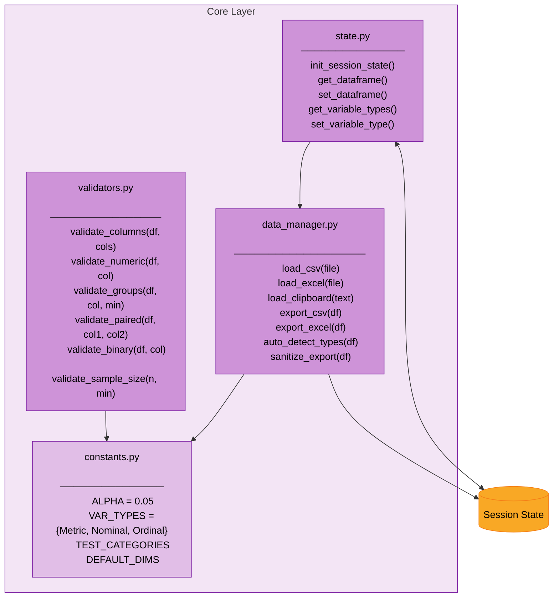
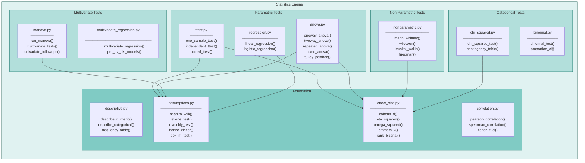
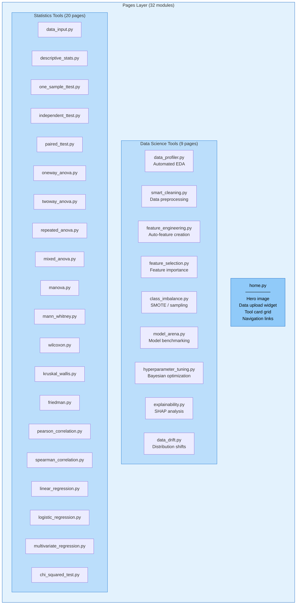
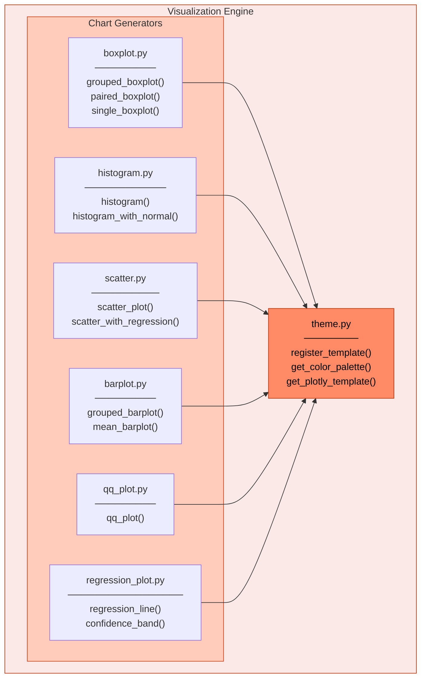
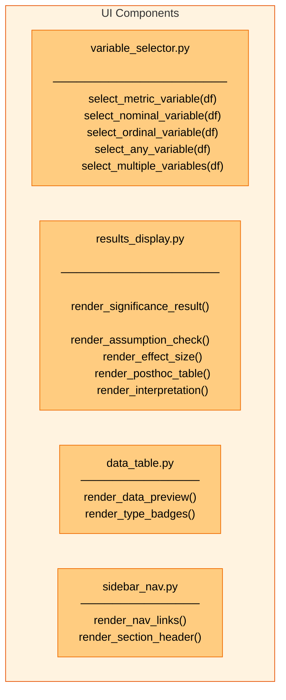
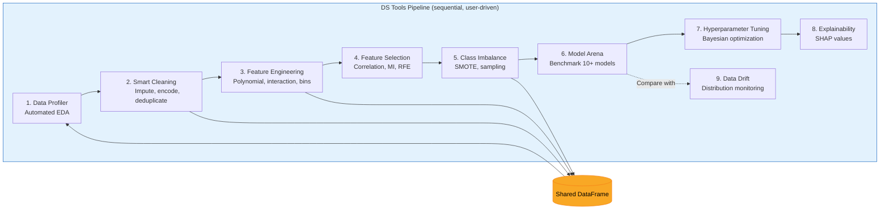

# C4 Model - Level 3: Component Diagram

## Overview

The Component diagram zooms into each container to reveal the internal modules
and their interactions. This level shows how responsibilities are distributed
within each architectural layer.

## Core Layer Components

## Statistics Engine Components

## Pages Layer Components

## Visualization Engine Components

## UI Components Detail

## Cross-Container Component Interactions

```mermaid
flowchart TD
    subgraph PAGE["Statistics Page (e.g., oneway_anova.py)"]
        RENDER["render()"]
    end

    subgraph CORE["Core"]
        GET_DF["state.get_dataframe()"]
        VALIDATE["validators.validate_groups()"]
    end

    subgraph COMP["Components"]
        VAR_SEL["variable_selector.select_metric_variable()"]
        GRP_SEL["variable_selector.select_nominal_variable()"]
        RESULT["results_display.render_significance_result()"]
        ASSUME_R["results_display.render_assumption_check()"]
    end

    subgraph STATS["Statistics Engine"]
        ANOVA_FN["anova.oneway_anova()"]
        ASSUME_FN["assumptions.shapiro_wilk()"]
        EFFECT_FN["effect_size.eta_squared()"]
    end

    subgraph VIZ["Charts"]
        BOX_FN["boxplot.grouped_boxplot()"]
    end

    subgraph THEME["Utils"]
        STYLE["theme.apply_theme()"]
    end

    RENDER --> GET_DF
    RENDER --> VAR_SEL & GRP_SEL
    RENDER --> VALIDATE
    RENDER --> ANOVA_FN
    ANOVA_FN --> ASSUME_FN & EFFECT_FN
    RENDER --> BOX_FN
    RENDER --> RESULT & ASSUME_R
    RENDER --> STYLE

    style PAGE fill:#bbdefb,stroke:#1565c0
    style CORE fill:#ce93d8,stroke:#7b1fa2
    style COMP fill:#ffcc80,stroke:#ef6c00
    style STATS fill:#80cbc4,stroke:#00695c
    style VIZ fill:#ffab91,stroke:#bf360c
    style THEME fill:#dce775,stroke:#827717
```

## Data Science Pipeline Flow

