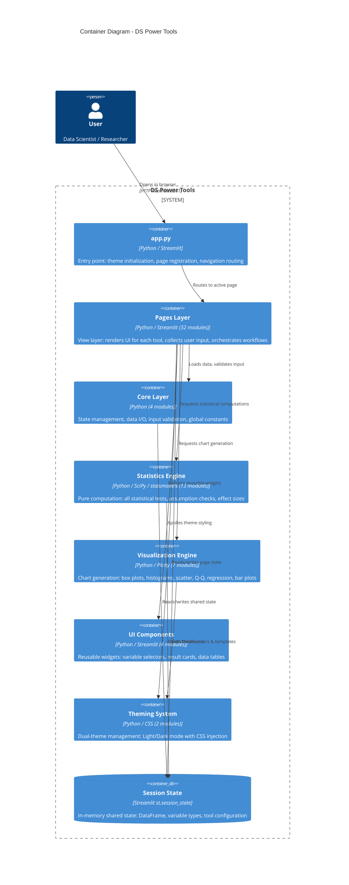
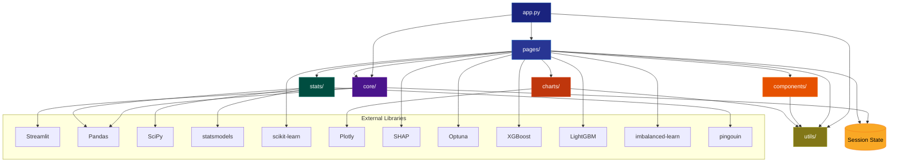
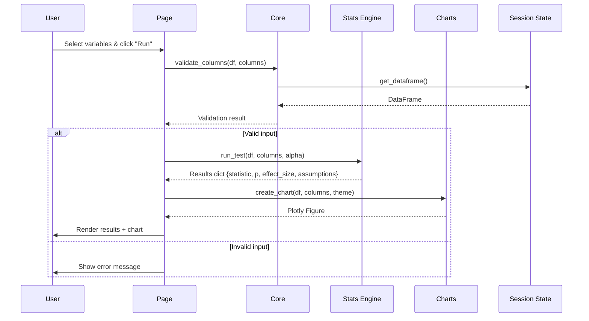

# C4 Model - Level 2: Container Diagram

## Overview

The Container diagram zooms into the DS Power Tools system boundary, revealing the
major deployable units and their interactions. In this application, "containers" map
to Python package directories that form distinct architectural layers.

## Key Observations

- Single-process architecture: all containers run within one Streamlit Python process
- Session state acts as an in-memory message bus between containers
- The `pages/` container is the thickest layer (32 modules) but delegates all computation
- Clear separation: pages never compute statistics directly; stats never render UI

## Container Diagram

## Dependency Graph

## Container Responsibilities

### app.py (Entry Point)
- Initializes Streamlit page config (layout, title, icon)
- Calls `core/state.py` to set up session defaults
- Applies global theme CSS via `utils/theme.py`
- Registers all 32 pages with `st.navigation()`
- Renders sidebar (theme selector, branding, navigation)

### Pages Layer (32 modules)
| Category | Count | Responsibility |
|---|---|---|
| Home | 1 | Data upload, tool card navigation |
| Data Science | 9 | EDA, cleaning, feature engineering, model training, explainability, drift detection |
| Statistics | 20 | Data input, descriptive stats, t-tests, ANOVA, non-parametric, correlation, regression, chi-squared, binomial, MANOVA |
| Navigation | 2 | Sidebar helpers, page routing |

### Core Layer (4 modules)
| Module | Responsibility |
|---|---|
| `state.py` | Initialize session defaults, provide getter/setter API for DataFrame and variable types |
| `data_manager.py` | Load CSV/Excel/clipboard, auto-detect variable types, export with formula injection prevention |
| `validators.py` | Validate column existence, numeric types, group structures, paired data, binary variables |
| `constants.py` | Alpha level (0.05), variable type enums, test category definitions, default dimensions |

### Statistics Engine (13 modules)
| Module | Tests |
|---|---|
| `descriptive.py` | Mean, median, mode, SD, skewness, kurtosis, quartiles, frequencies |
| `assumptions.py` | Shapiro-Wilk, Levene's, Mauchly's, Henze-Zirkler, Box's M |
| `ttest.py` | One-sample, independent (Student's & Welch's), paired |
| `anova.py` | One-way, two-way, repeated measures, mixed |
| `manova.py` | Wilks' lambda, Pillai's trace, Hotelling-Lawley, Roy's GR |
| `multivariate_regression.py` | Multi-DV regression with multivariate tests |
| `nonparametric.py` | Mann-Whitney, Wilcoxon, Kruskal-Wallis, Friedman |
| `correlation.py` | Pearson, Spearman with Fisher's z CIs |
| `regression.py` | Linear (OLS), logistic with standardized betas, odds ratios |
| `chi_squared.py` | Chi-squared independence test, Cramer's V |
| `binomial.py` | Binomial test with CIs |
| `effect_size.py` | Cohen's d, eta-squared, omega-squared, Cramer's V, rank-biserial |

### Visualization Engine (7 modules)
| Module | Chart Types |
|---|---|
| `boxplot.py` | Grouped, paired, single box plots |
| `histogram.py` | Frequency histograms with normal curve overlay |
| `scatter.py` | Scatter plots with optional regression line |
| `barplot.py` | Grouped bar plots with means and error bars |
| `qq_plot.py` | Q-Q plots for normality diagnosis |
| `regression_plot.py` | Regression line with confidence bands |
| `theme.py` | Plotly template registration, color palettes per theme |

### UI Components (4 modules)
| Module | Components |
|---|---|
| `variable_selector.py` | Type-aware dropdown pickers (metric, nominal, ordinal, multi-select) |
| `results_display.py` | Significance cards, assumption badges, effect size gauges |
| `data_table.py` | Compact data preview with variable type annotations |
| `sidebar_nav.py` | Navigation link generators |

### Theming System (2 modules)
| Module | Responsibility |
|---|---|
| `utils/theme.py` | CSS generation for Light (cream/red) and Dark (blue-purple/cyan) themes, widget styling, metric cards |
| `charts/theme.py` | Plotly template objects per theme, color scales, font choices, grid styling |

## Inter-Container Communication

All communication flows through **Streamlit session state** - there are no direct
function callbacks or event emitters between containers. This creates a simple,
predictable data flow:

