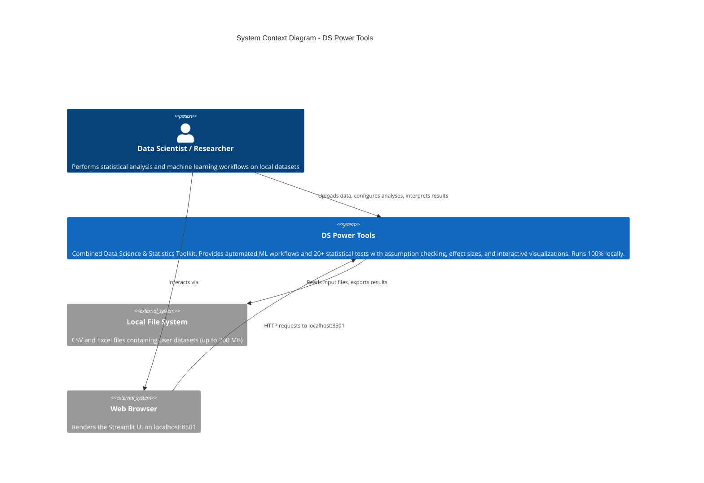
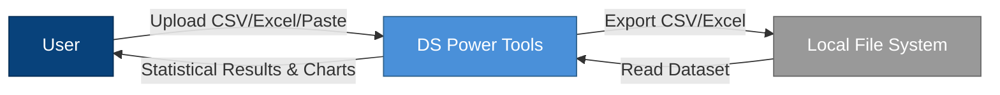
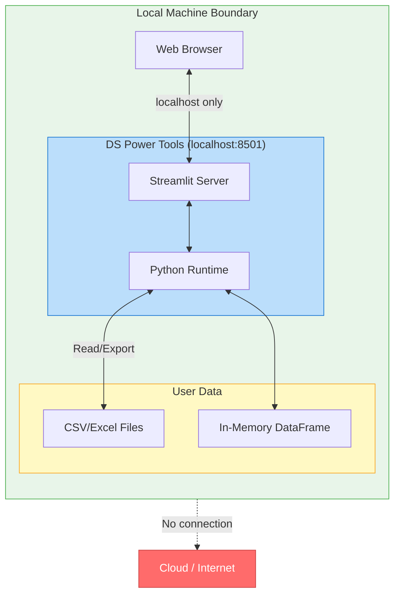

# C4 Model - Level 1: System Context Diagram

## Overview

The System Context diagram shows DS Power Tools as a single system and its relationship
to the users and external entities it interacts with. This is the highest level of
abstraction, showing the "big picture."

## Key Observations

- DS Power Tools is a **fully local application** with zero external service dependencies
- The only actor is the end user on a local machine
- Data never leaves the local environment - a deliberate privacy-first architecture
- The system boundary encompasses all computation, storage, and presentation

## Diagram

## Data Flow Summary

## Latency Characteristics

| Interaction | Typical Latency | Notes |
|---|---|---|
| File Upload | < 1s for < 50 MB | Pandas read_csv/read_excel |
| Statistical Test | < 500ms | SciPy/statsmodels computations |
| ANOVA with Post-hoc | < 2s | Iterative pairwise comparisons |
| Model Arena (10 models) | 10-60s | K-fold cross-validation across all models |
| Hyperparameter Tuning | 30s-5min | Bayesian optimization (Optuna), user-configurable trials |
| SHAP Explainability | 5-30s | Depends on model complexity and data size |
| Chart Rendering | < 1s | Plotly client-side rendering |

## Privacy Boundary

> **Design Decision**: The system is architecturally incapable of sending data externally.
> There are no HTTP client libraries imported, no API keys configured, and Streamlit's
> usage telemetry is explicitly disabled in `.streamlit/config.toml`.
